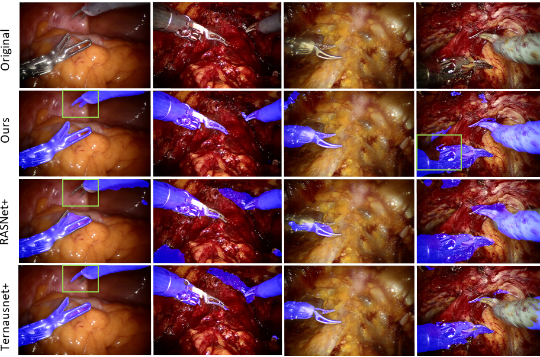

# Co-Generation and Segmentation for Generalized Surgical Instrument Segmentation on Unlabelled Data

Keras/Tensorflow implementation of coSegGAN. This work has been published in Medical Image Computing and Computer Assisted Intervention – MICCAI 2021 (https://miccai2021.org/en/).

[<a href="https://arxiv.org/abs/2103.09276" target="_blank">arXiv</a> / <a href="https://link.springer.com/epdf/10.1007/978-3-030-87202-1_39?sharing_token=ajyXq8Wr3FCN1w3fyLJl8Pe4RwlQNchNByi7wbcMAY5jIjVfLm7XRSlmEv2IA6krM3ROQ4V5ULwAWxb1Fz1mjdUQpDH8xAMq7sZpoXcVl4OqoN-UhGwS7-zUQzcYkh2GLoe6K_NG9vQWW0ymts1VTzBXvGJ2c7haUWox0a-JqEM%3D" target="_blank">Paper</a>]

<p align="left">
<a href="#"></a>
</p>

### Dependencies
```
Python 3.6
Tensorflow: 2.0.0
Keras: 2.3.1
```

### Environment Setup

Recreate conda environment as follows:
```
conda env create -f environment.yml
```

Or if you are using Docker:
```
docker pull tazleef/tf2.0.0-cv-keras2.3.1-imgaug:latest
```

### Training

Due to privacy policy, we are unable to share our surgical dataset. However, we intend to release them soon once we get the approval. For now, we have included a few sample cases for reference. Alternatively, if you have your own data, format it in the same way and set the filepath and training parameters in `train.py`. 

To train the model, run `train.py`. 

This code can also be used for other segmentation tasks with domain variations.  

### Contact 

If you face any problem using this code then please create an issue in this repository or contact me at [tajwaraleef@ece.ubc.ca](mailto:tajwaraleef@ece.ubc.ca?subject=[GitHub]%20coSegGAN%20Issue%20)

<!-- ### Acknowledgements

The code is based on []() -->

### License
MIT
